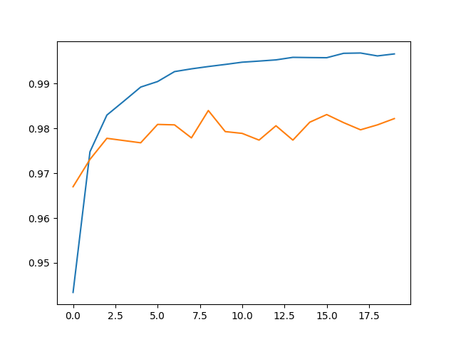
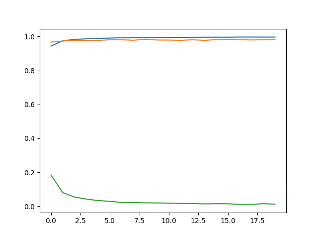
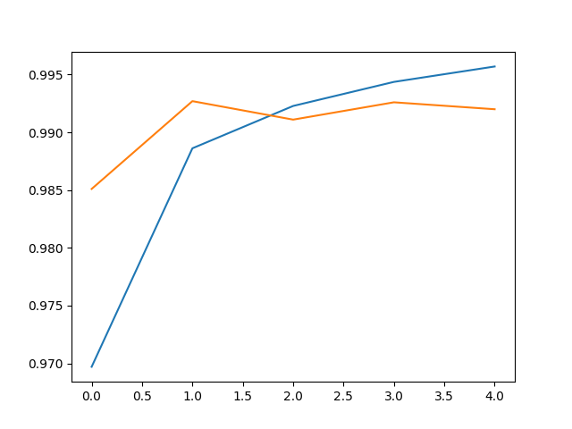
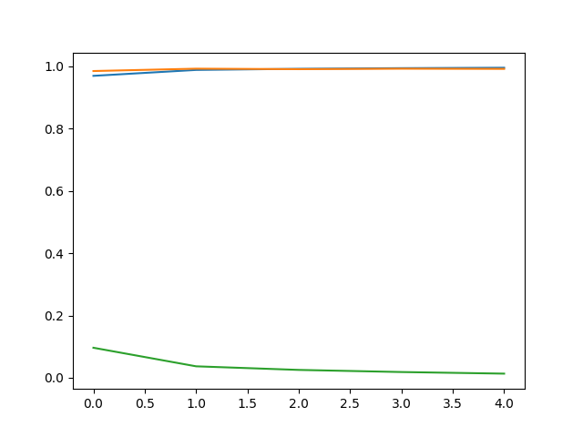

# Neural Network Training using Keras

## Data set

 - [MNIST](http://yann.lecun.com/exdb/mnist/)

## Non-Convolutional Neural Network

 Accuracy
 Validation accuracy

 Accuracy
 Validation accuracy
 Loss

## Convolutional Neural Network

 Accuracy
 Validation accuracy

 Accuracy
 Validation accuracy
 Loss

## Reference

 - [LinkedIn Learning: Neural Networks and Convolutional Neural Networks Essential Training](https://www.linkedin.com/learning/neural-networks-and-convolutional-neural-networks-essential-training/)